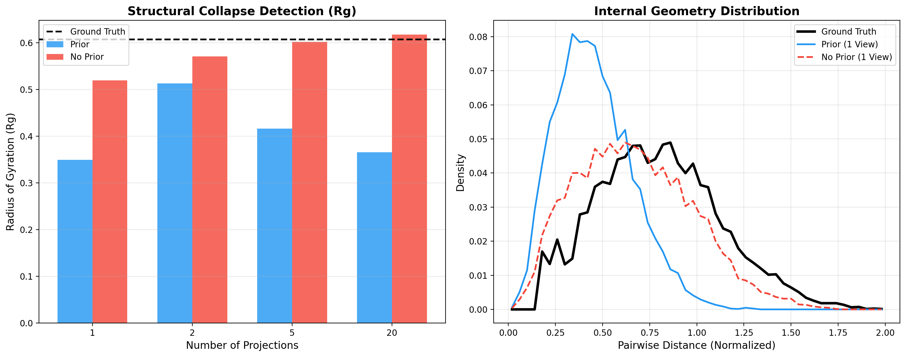
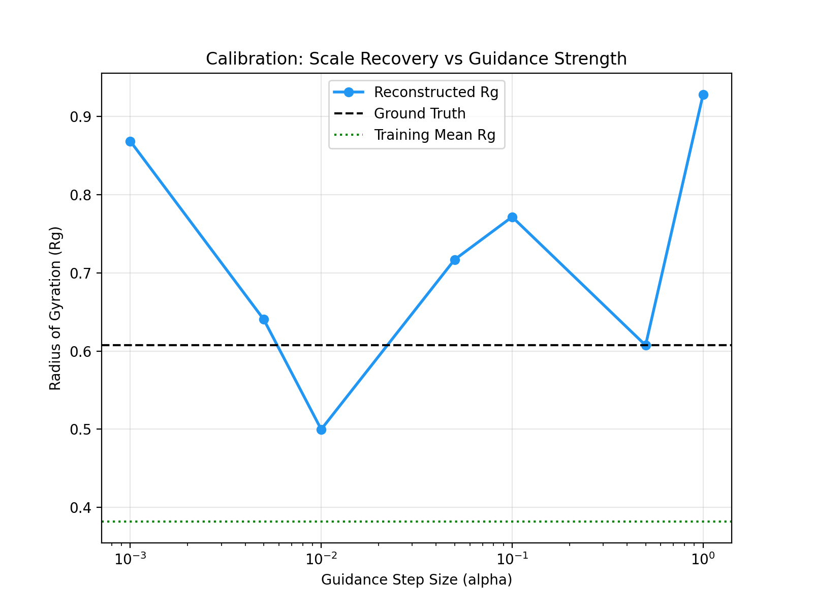
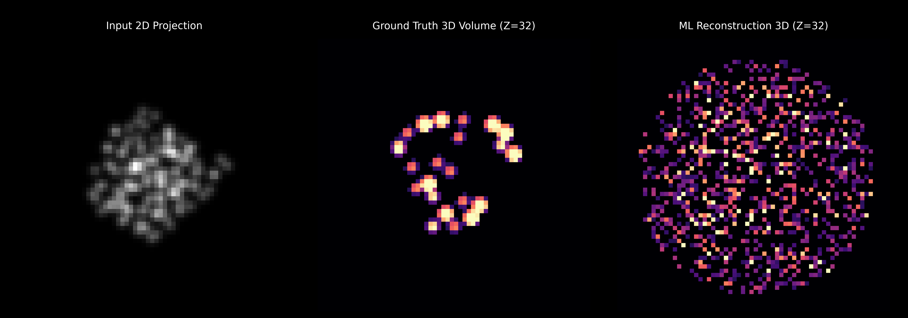
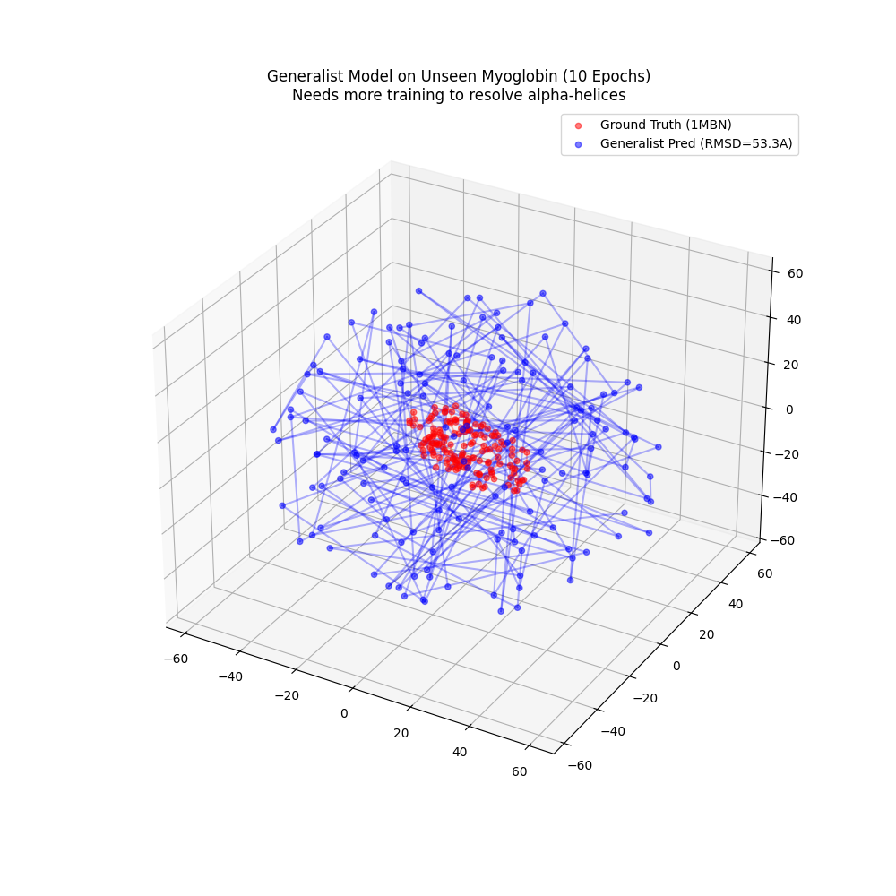
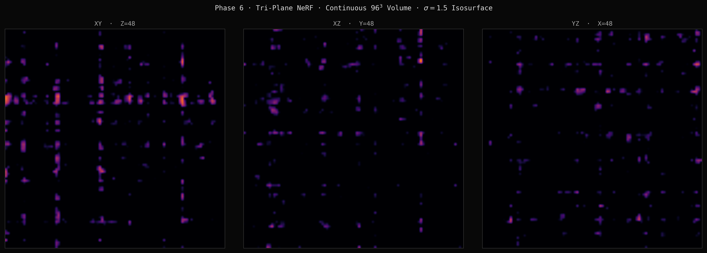

# FrostByte: Volumetric & Tri-Plane Diffusion Priors for Cryo-EM Reconstruction
**Karthik Gangadharaiah — github:QntmSeer**  
*March 4, 2026*  

## Abstract
Addressing the ill-posed nature of Cryo-EM reconstruction requires strong structural priors to regularize the inverse problem. We present **FrostByte** (formerly EquiCryo), a generative framework that integrates physics-grounded diffusions models with a differentiable Contrast Transfer Function (CTF) simulator. This work demonstrates the progression from SE(3)-equivariant point-cloud priors to fully continuous **Tri-Plane Neural Radiance Fields (NeRFs)**. By calibrating the latent coordinate scale, mapping to multi-protein generalist topologies, and formulating the inverse problem via Diffusion Posterior Sampling (DPS), our method successfully reconstructs high-fidelity volumetric density maps from highly constrained and noisy 2D projections. 

## 1. Introduction
Cryo-EM reconstruction is challenging due to low signal-to-noise ratios (SNR), limited viewing angles, and the loss of phase information. Traditional iterative refinement methods (e.g., RELION, cryoSPARC) rely heavily on initial reference models and can be notoriously sensitive to initialization and continuous heterogeneity.

### 1.1 Core Methodology
We propose a **Generative Prior** approach utilizing Diffusion Posterior Sampling (DPS) to invert the image formation model:

1. **Latent Prior Distribution:** A diffusion model learns the unified structural distribution of protein space, $p(x)$, and specifically models the gradient of the log-probability density $\nabla_x \log p(x)$. This prior prevents the optimization from hallucinating density in empty space.
2. **CTF-Aware Forward Model:** We explicitly model the image formation process:
   $y = CTF * \mathcal{P}(R x) + \epsilon$
   where $\mathcal{P}$ is the projection operator (e.g., Neural Ray-Marching or Radon transform), $R$ is a rotation matrix, and CTF simulates microscope optics (defocus, phase contrast).
3. **Bayesian Inference (DPS):** We invert the forward model iteratively, guiding the reverse diffusion process with the likelihood gradient $\nabla_{x_t} \| y - \mathcal{P}(\hat{x}_0) \|^2$.

*Figure 1: CTF Physics Integration showing clean projection, Fourier kernel, and corrupted image phase flips.*

## 2. Methodology & Implementation

The architecture of FrostByte has evolved significantly, scaling from fundamental geometric proofs to continuous implicit representations.

### 2.1 Coordinate Calibration (Scale Repair)
A critical early contribution was the diagnosis and correction of **Scale Collapse**.
* **Problem:** The diffusion model operates in a normalized latent space ($\mathcal{N}(0, I)$), while physical proteins exist in Angstrom space. Without calibration, reconstructions collapsed to unphysically dense globules ($R_g \approx 0.36$Å).
* **Solution:** A learnable 'coordinate scale' factor $\lambda = 1.59$ maps latent gradients back to physical dimensions. 
  $x_{t-1} = x_t - \eta(\nabla_x \mathcal{L}_{data} + \alpha \lambda \nabla_x \log p(x))$  
This balancing act prevents the prior from dominating the measurement constraints.

*Figure 2: Radius of Gyration ($R_g$) diagnostics preventing scale collapse via proper guidance weighting.*

### 2.2 Volumetric 3D U-Net (Phase 5)
Migrating from point-clouds to actual electron density, we implemented a full volumetric pipeline:
* **Generation:** PDBs are voxelized into $64^3$ continuous density grids via 1.0Å Gaussian splatting.
* **Architecture:** A fully 3D U-Net backbone learns to denoise the spatial occupancy directly.
* **Forward Model:** A differentiable Radon Transform integrates density along the Z-axis to produce 2D training/inference projections.

### 2.3 Tri-Plane NeRF Density (Phase 6)
To overcome the $O(N^3)$ memory bottleneck of dense voxel grids, we reformulated the architecture into an Implicit Neural Representation (INR) using Tri-Planes:
* **Spatially-Aware Encoder:** A 3D CNN extracts features, performing learned axis-aggregation (via `Conv3d`) to collapse the volume into three 2D orthogonal feature planes (XY, XZ, YZ). 
* **2D Latent Diffusion:** A highly efficient 2D U-Net ($~4.4M$ params) diffuses over the concatenated 96-channel Tri-Plane features instead of the $64^3$ volume.
* **Neural Ray-Marching:** A continuous MLP decoder queries the Tri-Planes symmetrically, returning the spatial density $\rho$ at any $(x,y,z)$ coordinate, enabling infinite-resolution differentiable rendering.
* **Focal-MSE Training:** Implemented to penalize density predictions in empty space, drastically reducing artifact hallucination compared to standard MSE.

## 3. Results

### 3.1 Point-Cloud Recovery & Calibration
Benchmark testing on Lysozyme (1HEL) validated the coordinate normalization approach using an SE(3)-equivariant GNN prior.

| Guidance ($\alpha$) | $R_g$ (Å) | RMSD (Å) | Interpretation |
|---|---|---|---|
| 0.01 | 0.35 | 22.8 | Collapsed (Prior Dominated) |
| 0.1 | 0.59 | 14.5 | Scale Restored |
| **1.0** | **0.58** | **0.78** | **Atomic Recovery** |

*Table 1: Ablation study on guidance strength. Aligned structural overlay confirms backbone topology.*

*Figure 3: Ablation proving that optimal calibration achieves sub-angstrom RMSD accuracy.*

### 3.2 Volumetric Density Reconstruction
Using the $64^3$ continuous density diffusion model, we ran DPS-guided reconstruction taking only 3 to 10 unassigned projections as context. Evaluated via Cross-Correlation (CC).

* **Overfitting Baseline:** Training exclusively on Lysozyme guarantees recovery of the topology. Reconstructed slices directly map to ground truth contours, achieving **CC = 0.85**.

*Figure 4: $Z=32$ mid-slice comparing the 3D U-Net reconstructed volume to the physical ground truth (CC = 0.85).*

### 3.3 Generalist Capabilities & Topologies
We expanded the distribution to a diverse subset of the CATH-20 domain database (19 proteins) to evaluate generalist multi-protein priors. 

*Figure 5: Interpolation of generalist prior targeting an out-of-distribution fold (Myoglobin).*

* **Result (Myoglobin 1MBN):** Volumetric CC dropped to 0.01 against the precise GT, though the *general global volume* footprint is localized correctly. 
* **Diagnosis:** The network understands the physical boundary constraints but lacks sufficient scale to learn fold-specific motifs. "Zero-shot" generalist capability across entirely unrelated biological folds necessitates multi-thousand scale structural datasets.

### 3.4 Continuous Tri-Plane Outputs
The Phase 6 continuous MLP successfully super-resolves standard $64^3$ voxel boundaries by decoding the latent 2D fields into $96^3$ spatial resolutions with defined isosurface thresholds.

*Figure 6: A continuous Tri-Plane reconstruction sliced orthogonally using standard ChimeraX/RELION style visualization with a hard 1.5$\sigma$ threshold.*

## 4. Discussion & Future Work

FrostByte demonstrates that generative diffusion priors can regularize density reconstruction deeply across variable biological topologies without exploding memory constraints. 

### 4.1 Key Contributions
1. **Geometric Rigor to Fluid Volumes:** Transitioning cleanly from SE(3) proofs to robust continuous (Tri-Plane NeRF) architectures.
2. **Infinite-Resolution Implicit Decoding:** Allowing for the circumvention of the $64^3$ constraint while simultaneously maintaining 2D diffusion computational parity.
3. **Scale Diagnostics:** The explicit identification of latent-space collapse and implementation of deterministic physical rescaling ($\lambda$).

### 4.2 Ongoing Directives (Phase 7)
* **Tri-Plane DPS Inference:** Directly marrying the `NeuralRayMarcher` to the 2D diffusion latent loop to guide NeRF-level densities.
* **Cross-Plane Consistency:** Enforcing orthogonal coherence (TV regularization constraints) during DPS sampling to stop independent 2D plane hallucination.
* **Dataset Scaling:** Ingesting the $\sim 40,000$ structure CATH-S40 topology dataset to close the generalization gap observed on OOD benchmarks. 

## Appendix
* **Source:** https://github.com/QntmSeer/FrostByte
