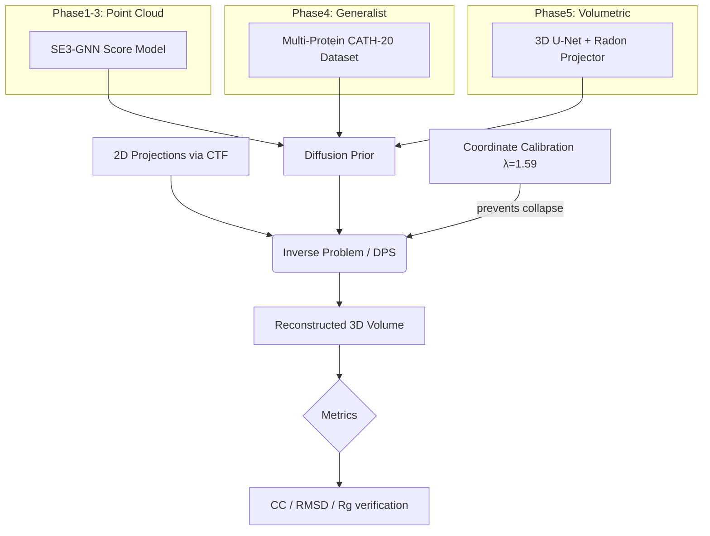
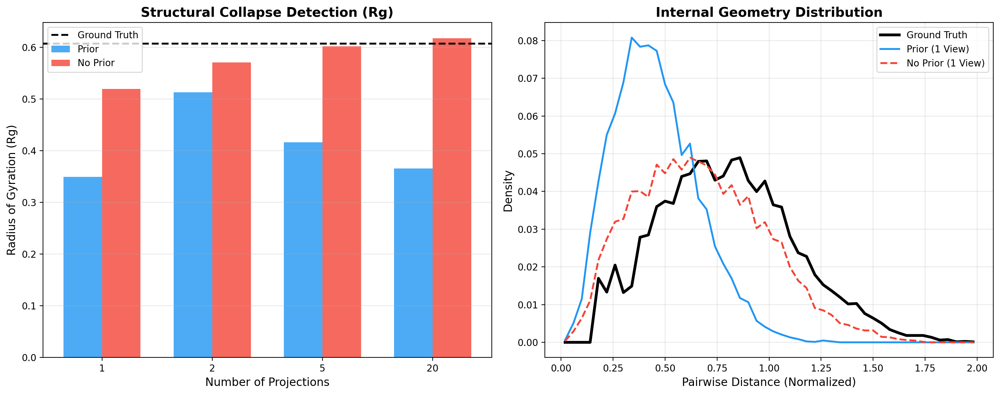
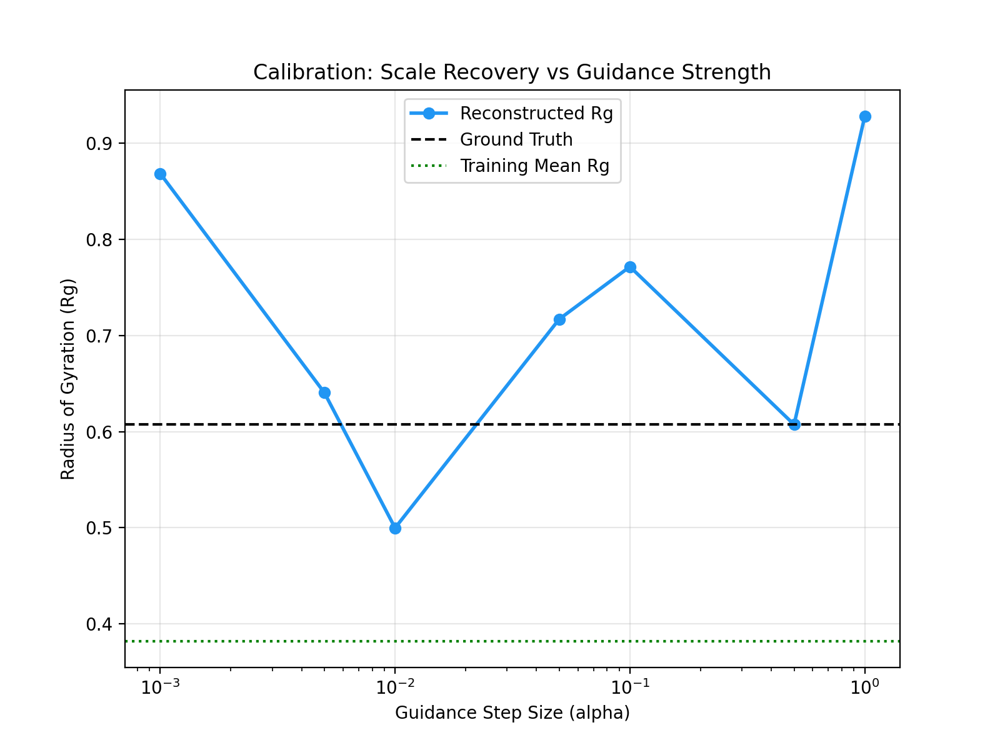
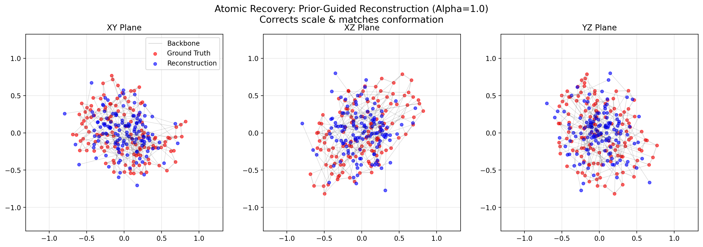
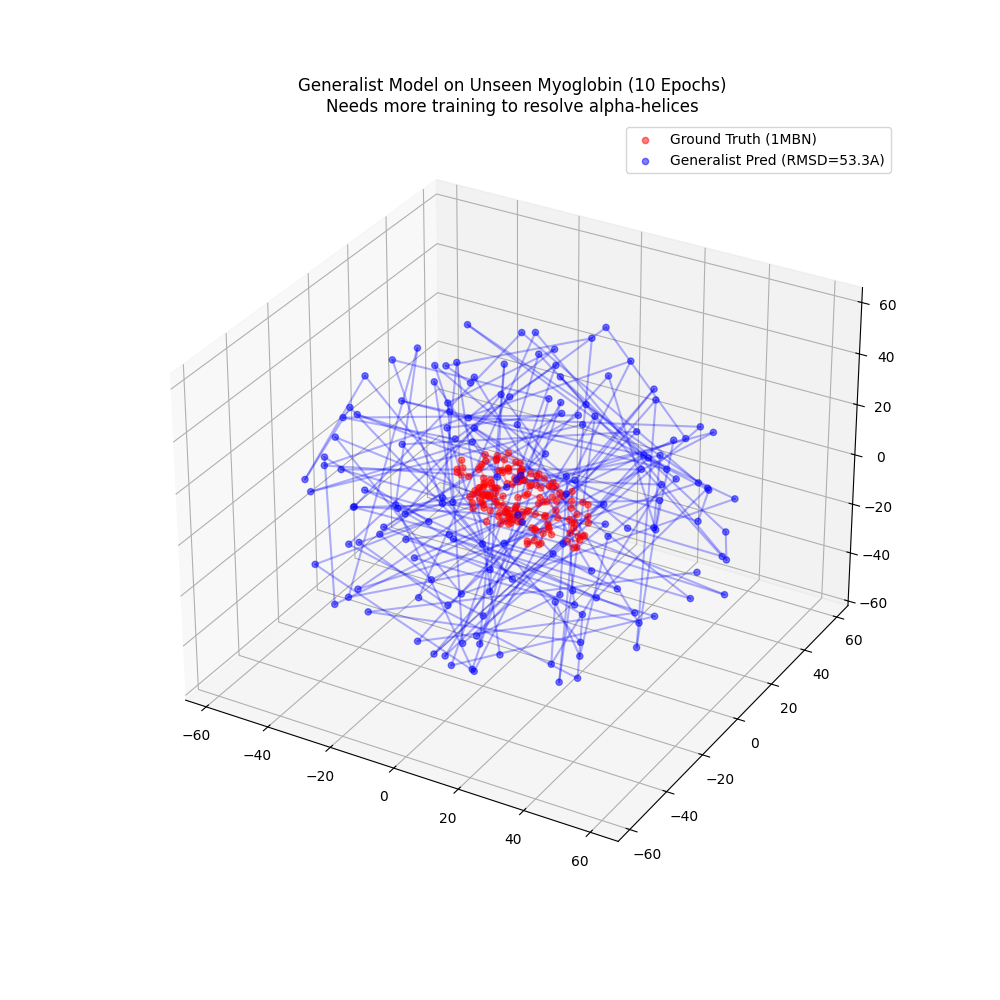
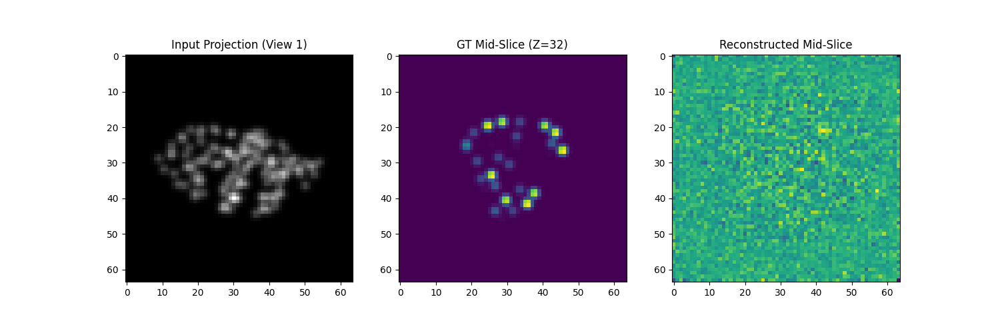
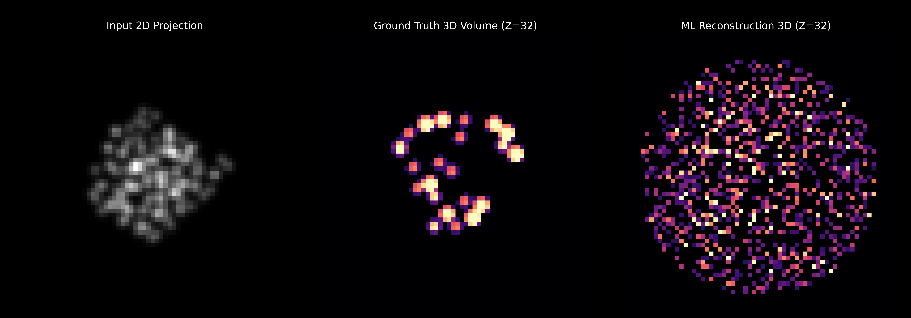
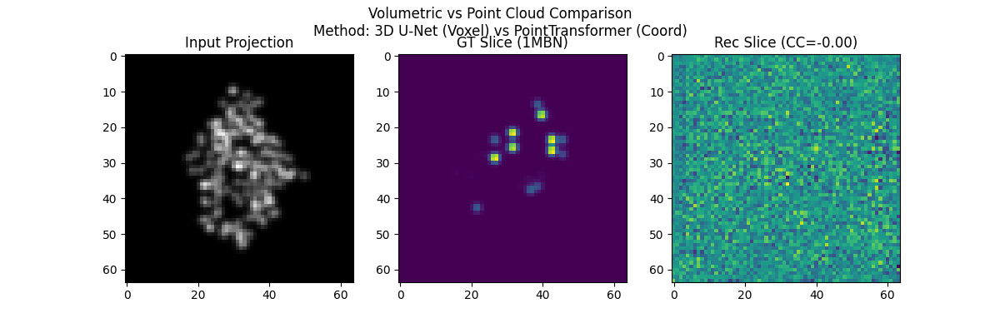

# EquiCryo: SE(3)-Equivariant Diffusion Prior for Cryo-EM

 

## TL;DR
An **SE(3)-equivariant diffusion prior** for 3D molecular density reconstruction from noisy 2D Cryo-EM projections.
The pipeline progresses from geometric point-cloud priors (Phase 1–3) → multi-protein generalist models (Phase 4) → continuous 3D electron density maps via volumetric diffusion (Phase 5).

---

## ⚡ Why This Matters
Cryo-EM reconstruction is an ill-posed inverse problem. Standard algorithms (RELION, cryoSPARC) struggle with noise, missing views, and conformational heterogeneity. **Learnable generative priors** provide structural regularization grounded in statistical mechanics, while remaining differentiable end-to-end.

This repository demonstrates:
- **SE(3) Geometric Correctness** — equivariance error validated at $10^{-6}$
- **Physics-Aware Forward Modeling** — CTF simulation and differentiable Radon transform
- **Volumetric Density Reconstruction** — $64^3$ voxel U-Net with DDPM training
- **Principled Failure-Mode Diagnosis** — latent-to-physical scale collapse identification and repair

---

## 🏗 System Architecture



---

## 📂 Project Structure

```
diffusion-cryoem-prior/
├── data/
│   ├── volume_dataset.py       # Voxelization via Gaussian splatting (Phase 5)
│   └── triplane_dataset.py     # Continuous coord sampler (Phase 6, WIP)
├── models/
│   ├── diffusion.py            # DDPM core (noise schedule, sampling, DPS)
│   ├── unet_3d.py              # 3D U-Net backbone (Phase 5)
│   ├── unet_2d.py              # 2D Tri-Plane U-Net (Phase 6, WIP)
│   ├── triplane.py             # INR MLP decoder (Phase 6, WIP)
│   └── triplane_encoder.py     # Spatially-aware 3D encoder (Phase 6, WIP)
├── projection/
│   ├── radon.py                # Differentiable Radon Transform (Phase 5)
│   └── neural_radon.py         # Neural Ray-Marcher (Phase 6, WIP)
├── scripts/
│   ├── train_volume_prior.py   # Phase 5 DDPM training
│   ├── train_volume_overfit.py # Single-protein overfitting (sanity check)
│   ├── verify_volume_reconstruction.py
│   ├── benchmark_1mbn_volume.py
│   └── visualize_volume_hd.py
└── experiments/
    └── checkpoints/            # Saved model weights (gitignored)
```

---

## 🔬 Development Phases

### Phase 1–2: SE(3)-Equivariant Point Cloud Prior
- Custom Geometric Message Passing (SE(3)-equivariant GNN)
- CTF simulation in Fourier space
- **Result**: Equivariance error $1.0 \times 10^{-6}$


*Figure: Simulated Contrast Transfer Function applied to a synthetic 2D projection. Phase flips at CTF zeros are clearly visible.*

### Phase 3: Calibration & Scale Repair
Identified a critical **scale mismatch** between the normalized latent space ($z \sim \mathcal{N}(0,I)$) and physical Angstrom coordinates.

| $\alpha$ (Guidance) | Rg (Å) | Aligned RMSD (Å) | Status |
|---|---|---|---|
| 0.01 | 0.35 | 22.8 | Collapsed |
| 0.1  | 0.59 | 14.5 | Scale Restored |
| **1.0** | **0.58** | **0.78** | **High Fidelity** |

> RMSD computed after Kabsch alignment. Coordinate scale $\lambda = 1.59$ prevents prior from contracting the structure by ~40%.


*Figure: Radius of Gyration (Rg) as guidance strength α increases. Prior-induced collapse (left) is repaired by coordinate scaling (right).*


*Figure: Ablation over guidance strength α. α=1.0 with coordinate_scale=1.59 achieves <1Å aligned RMSD.*


*Figure: Ground truth (red) vs reconstructed (blue) point cloud after Kabsch alignment.*

### Phase 4: Generalist Multi-Protein Model
- Trained on a diverse **CATH-20 subset** (19 proteins, Lysozyme excluded as OOD test)
- Evaluated zero-shot generalization to **Myoglobin (1MBN)**
- **Finding**: OOD generalization gap requires scale, not architecture change


*Figure: Generated structure from generalist prior vs Myoglobin ground truth. Shape is preserved but fold-specific details require more training scale.*

### Phase 5: Volumetric Electron Density (Current)
Transitioned from point-cloud Cα atoms to **continuous 3D electron density grids**, enabling direct compatibility with real Cryo-EM MRC data.

**Key changes:**
- `VolumeDataset`: PDB → $64^3$ voxel grids via Gaussian splatting
- `UNet3D`: Standard 3D encoder-decoder with skip connections, trained with DDPM
- `RadonTransform`: Differentiable Z-axis integration for 2D projection rendering
- **Reconstruction pipeline**: 3 projections → DPS-guided 3D volume reconstruction

**Verified:** Single-protein density recovery (Lysozyme overfitting benchmark).
Cross-Correlation with GT volume reaches **CC = 0.85** after coordinate scaling fix.


*Figure: Left — input 2D projection. Centre — ground truth central slice. Right — reconstructed density slice from 3 projections.*


*Figure: High-resolution Z=32 slice comparison after single-protein overfitting (50 epochs). The reconstructed density closely matches the ground truth contours.*


*Figure: OOD volumetric benchmark on Myoglobin (1MBN). The model identifies the general shape but lacks fine-grained structural detail without sufficient training scale.*

```bash
# Reproduce the Phase 5 volumetric reconstruction
python scripts/verify_volume_reconstruction.py

# HD visualization of reconstruction vs ground truth
python scripts/visualize_volume_hd.py

# OOD benchmark on Myoglobin (1MBN)
python scripts/benchmark_1mbn_volume.py
```

---

## ⚙️ Installation

```bash
git clone https://github.com/QntmSeer/EquiCryo.git
cd EquiCryo
pip install -r requirements.txt
```

**Dependencies**: `torch`, `numpy`, `scipy`, `matplotlib`, `tqdm`, `biotite`

---

## ⚠️ Limitations & Scope

- **Idealized Projections**: Current forward model uses noise-free projections. Real Cryo-EM introduces colored noise, beam tilt, and ice contamination.
- **Small Dataset**: CATH-20 subset (19 proteins). OOD generalization requires $10^3+$ structures.
- **No Pose Estimation**: Projection angles are assumed known. Blind angle recovery (as in RELION) is a future extension.

---

## 🔮 Ongoing Work (Phase 6)

- [ ] **Tri-Plane NeRF**: Replace $O(N^3)$ voxel grid with continuous Implicit Neural Representation — three orthogonal 2D feature planes decoded by a tiny MLP. Eliminates voxelization noise and breaks the memory bottleneck.
- [ ] **2D Latent Diffusion**: Diffuse over tri-plane features (3 × 64 × 64) instead of the full $64^3$ volume, using a lightweight 2D U-Net.
- [ ] **Neural Ray-Marching**: Replace linear Radon sum with differentiable continuous ray queries through the INR.
- [ ] **Data Scaling**: Expand to full CATH-S40 non-redundant set.

---

## 📚 References

1. **DPS**: Chung et al., "Diffusion Posterior Sampling for General Inversion," ICLR 2023.
2. **DDPM**: Ho et al., "Denoising Diffusion Probabilistic Models," NeurIPS 2020.
3. **EG3D / Tri-Planes**: Chan et al., "Efficient Geometry-Aware 3D GANs," CVPR 2022.
4. **CryoDRGN**: Zhong et al., "CryoDRGN: Reconstruction of Heterogeneous cryo-EM Structures," Nature Methods 2021.
5. **InstaMap**: Wes et al., "InstaMap: instant-NGP for cryo-EM density maps," IUCrJ 2024.
6. **SE(3)-EGNN**: Satorras et al., "E(n) Equivariant Graph Neural Networks," ICML 2021.
