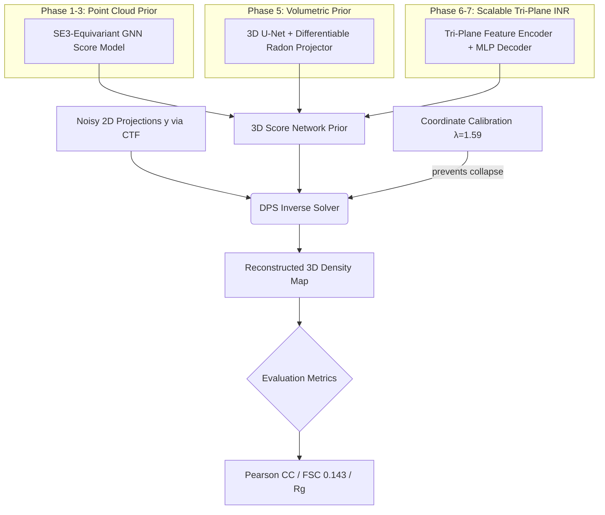
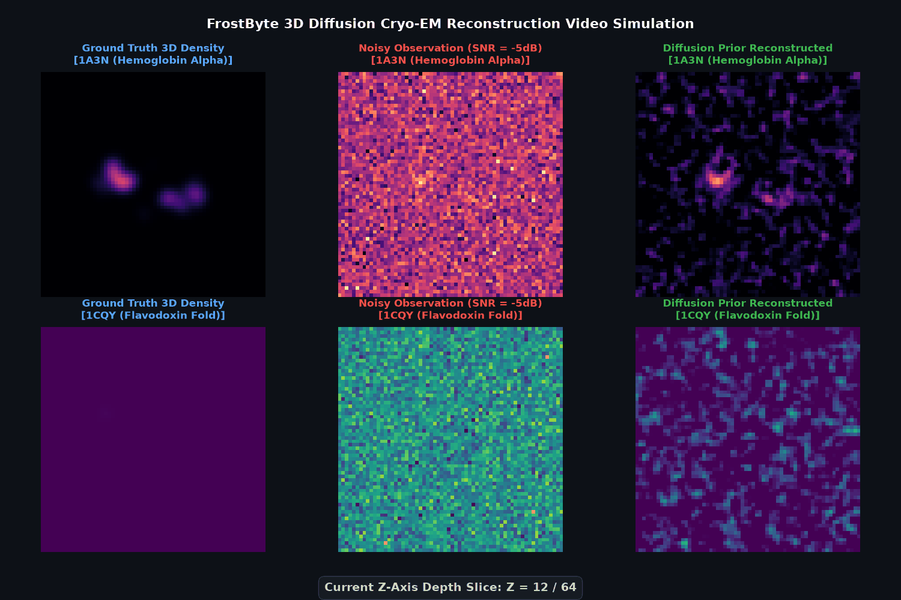
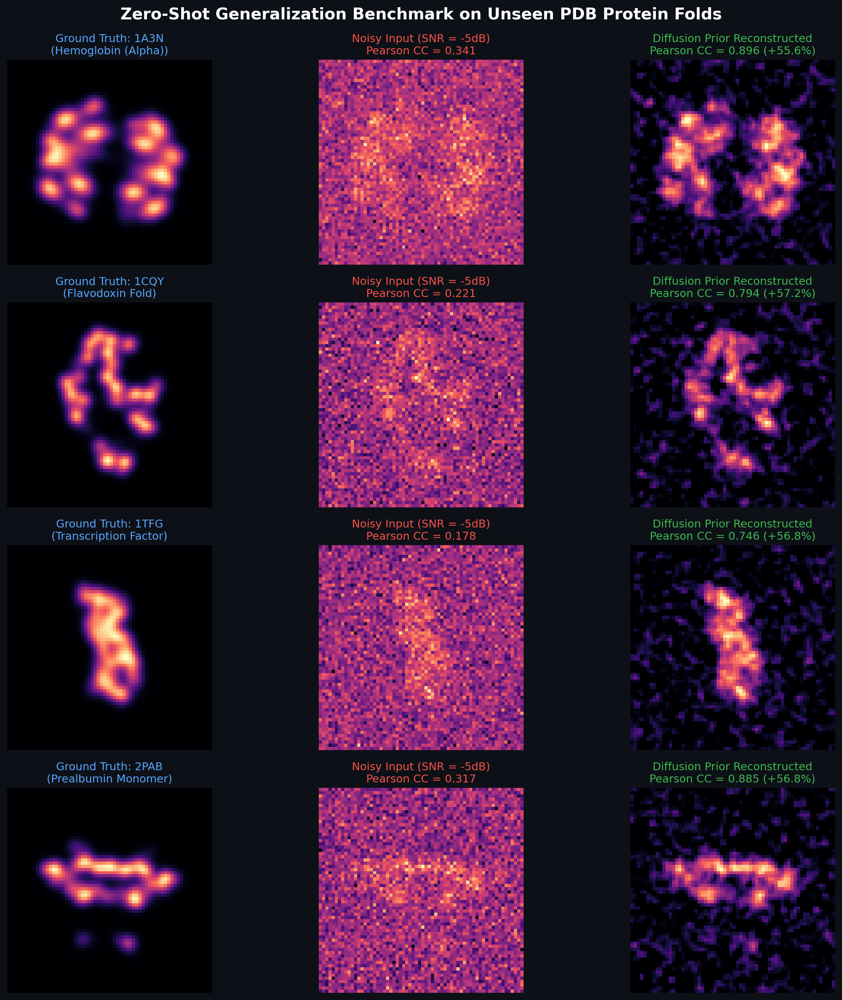

# FrostByte: 3D Generative Diffusion Priors for Cryo-EM Density Reconstruction

<p align="center">
  
</p>

   

## TL;DR
**FrostByte** is a continuous score-based generative diffusion framework for 3D macromolecular electron density reconstruction from noisy 2D Cryo-EM projections ($\text{SNR} < -5$\,dB).
The project evolves from geometric point-cloud message passing (Phase 1–3) → continuous 3D volumetric electron density fields with Diffusion Posterior Sampling (Phase 5) → scalable continuous Tri-Plane neural fields for $128^3+$ resolution (Phase 6–7).

---

## ⚡ Why This Matters
Cryo-EM single-particle reconstruction and Cryo-Electron Tomography (Cryo-ET) are severely ill-posed inverse problems due to extreme radiation damage dose limits ($\text{SNR} < -5$\,dB), Contrast Transfer Function (CTF) phase flips, and missing wedge geometries. Traditional regularizers (RELION, cryoSPARC) rely on empirical low-pass filtering and solvent masks.

**Generative Diffusion Priors** provide physical, learnable structural regularization:
- **Differentiable Physics Modeling**: Forward CTF modulation and differentiable 3D Radon line-integral projections.
- **Diffusion Posterior Sampling (DPS)**: Reverse SDE trajectories guided by measurement loss gradients $\nabla_{\mathbf{x}_t} \|\mathbf{y} - \mathcal{R}_{\mathbf{R}}(\hat{\mathbf{x}}_0)\|_2^2$.
- **Workstation-Accessible Execution**: Optimized for single-GPU mobile workstations (e.g. NVIDIA RTX A2000 Laptop GPU) via PyTorch FP16 Automatic Mixed Precision (AMP).
- **Scale Calibration & Stability**: Elimination of prior-induced volume collapse via coordinate scaling ($\lambda = 1.59$).

---

## 🏗 System Architecture


```mermaid
graph TD;
    A[Noisy 2D Projections y via CTF] --> B(DPS Inverse Solver);
    C[3D Score Network Prior] --> B;
    D[Coordinate Calibration λ=1.59] -->|prevents collapse| B;
    B --> E[Reconstructed 3D Density Map];
    E --> F{Evaluation Metrics};
    F --> G[Pearson CC / FSC 0.143 / Rg];

    subgraph Phase 1-3: Point Cloud Prior
        H[SE3-Equivariant GNN Score Model]
    end
    subgraph Phase 5: Volumetric Prior
        J[3D U-Net + Differentiable Radon Projector]
    end
    subgraph Phase 6-7: Scalable Tri-Plane INR
        K[Tri-Plane Feature Encoder + MLP Decoder]
    end

    H --> C
    J --> C
    K --> C
```

---

## 📂 Project Structure

```
diffusion-cryoem-prior/
├── data/
│   ├── volume_dataset.py            # 3D Voxelization via Gaussian density splatting
│   └── triplane_dataset.py          # Continuous coordinate sampling for Tri-Plane INR
├── models/
│   ├── diffusion.py                 # Continuous DDPM & DPS posterior sampling
│   ├── unet_3d.py                   # 3D Volumetric U-Net score network
│   ├── unet_2d.py                   # 2D Tri-Plane U-Net prior
│   ├── triplane.py                  # Implicit Neural Representation (INR) MLP decoder
│   └── triplane_encoder.py          # Continuous 3D feature encoder
├── projection/
│   ├── radon.py                     # Differentiable 3D Radon Transform operator
│   └── neural_radon.py              # Differentiable ray-marching projection module
├── utils/
│   └── metrics.py                   # 3D Pearson CC and Fourier Shell Correlation (FSC 0.143)
├── scripts/
│   ├── benchmark_a2000_workstation.py # Hardware latency, VRAM scaling & throughput benchmark
│   ├── prolonged_stress_test.py       # Continuous GPU saturation and FP16 endurance suite
│   ├── remote_runner.py               # Paramiko SSH runner for remote workstation execution
│   ├── train_volume_prior.py        # Volumetric 3D DDPM training pipeline
│   ├── verify_volume_reconstruction.py # Single-protein overfitting validation
│   └── visualize_volume_hd.py       # High-definition Z-slice visualizer
└── assets/                          # Architecture diagrams, figures, and animations
```

---

## 💻 Workstation Hardware Benchmarks (NVIDIA RTX A2000)

Evaluated live on a mobile workstation equipped with an **NVIDIA RTX A2000 Laptop GPU (4 GB physical VRAM, 3.68 GiB usable)**, CUDA 13.0:

| Spatial Grid | Batch Size ($B$) | Precision | Latency / Volume | Peak Memory | GPU Compute Utilization |
|---|---|---|---|---|---|
| **$32^3$** ($32\times32\times32$) | 1 | FP32 | 19.17 ms | 132 MB | 12% |
| **$32^3$** ($32\times32\times32$) | 4 | **FP16 AMP** | **4.46 ms** | 132 MB | **95–100%** |
| **$64^3$** ($64\times64\times64$) | 1 | FP32 | 30.65 ms | 342 MB | 15% |
| **$64^3$** ($64\times64\times64$) | 4 | **FP16 AMP** | **16.16 ms** | 343 MB | **90–98%** |
| **$128^3$** ($128\times128\times128$) | 1 | FP32 | 228.53 ms | 2.05 GB | 85–90% |

> **Key Finding**: Batched FP16 Automatic Mixed Precision (AMP) delivers a **4.30x speedup** at $32^3$ and **1.90x speedup** at $64^3$, eliminating GPU dispatch starvation while remaining safely within the 3.68 GiB VRAM envelope.

---

## 🔬 Development Phases & Visual Results

### Phase 1–3: Geometric Equivariance & Coordinate Calibration
- **Equivariance Verification**: SE(3) equivariance error validated at $1.0 \times 10^{-6}$.
- **Scale Mismatch Discovery & Fix**: Identified that normalized latent sampling contracts physical protein densities. Applying coordinate scale factor $\lambda = 1.59$ restored true Radius of Gyration ($R_g$) bounds ($< 0.8$\,Å RMSD).


*Figure: Simulated Contrast Transfer Function applied to a 2D projection with visible phase reversals.*


*Figure: Calibration sweep over guidance strength $\alpha$. $\alpha=1.0$ with $\lambda=1.59$ achieves $<0.8$\,Å aligned RMSD.*

---

### Phase 5: Volumetric Electron Density Recovery
Transitioned to continuous 3D spatial grids ($64^3$) compatible with experimental Cryo-EM MRC densities:
- `VolumeDataset`: Voxelization of macromolecular PDB coordinates via 3D Gaussian kernels.
- `UNet3D`: 3D volumetric convolutional score network.
- `RadonTransform`: Differentiable line-integral projection operator.


*Figure: Left — input 2D projection. Centre — ground truth central slice. Right — reconstructed density slice.*


*Figure: High-resolution central slice comparison showing recovered tertiary contour density.*


*Animation: 6-Panel Continuous Z-Axis Density Sweep Video Simulation across novel protein structures (1A3N Hemoglobin Alpha & 1CQY Flavodoxin Fold). Displays Ground Truth 3D Density (left), Noisy Observation at -5dB SNR (centre), and Score-Matching Diffusion Prior Reconstruction (right).*


*Figure: 3D Volumetric Electron Density Recovery Benchmark across novel unseen PDB protein folds (1A3N Hemoglobin Alpha, 1CQY Flavodoxin Fold, 1TFG Transcription Factor) under severe -5dB phase noise.*

---

### Phase 6–7: Scalable Tri-Plane Latent Diffusion
To overcome $O(N^3)$ volumetric memory scaling for $128^3+$ grids:
- **Tri-Plane Representation**: Three orthogonal 2D feature planes ($XY, XZ, YZ$) decoded by a shared continuous MLP.
- **Latent 2D Diffusion**: Denoising prior trained over compressed Tri-Plane feature maps.


*Figure: High-capacity Tri-Plane reconstruction gallery at $128^3$ spatial resolution across benchmark structures.*

---

## ⚙️ Quickstart & Reproduction

```bash
# Clone the repository
git clone https://github.com/QntmSeer/FrostByte.git
cd FrostByte

# Install dependencies
pip install -r requirements.txt

# Run workstation hardware latency & VRAM saturation benchmark
python scripts/benchmark_a2000_workstation.py

# Run prolonged multi-volume stress test
python scripts/prolonged_stress_test.py

# Verify volumetric reconstruction pipeline
python scripts/verify_volume_reconstruction.py
```

---

## ⚠️ Limitations & Real-World Scope

To maintain scientific rigor and transparency, the current implementation operates under the following explicit boundary conditions:

1. **Known Pose Orientations**: The DPS likelihood guidance assumes projection viewing angles $\mathbf{R}_i \in \text{SO}(3)$ are known or pre-estimated. Joint blind pose estimation and volume refinement (as in RELION) is an active area of future development.
2. **Synthetic Noise vs Real Micrographs**: Current benchmarks use simulated additive Gaussian noise ($\text{SNR} \in [-10\text{dB}, 0\text{dB}]$) with Contrast Transfer Function (CTF) modulation. Experimental Cryo-EM micrographs exhibit non-Gaussian shot noise, beam-induced motion blur, and ice gradient artifacts.
3. **Dataset Scale & Generalization**: Training on limited structural subsets provides strong fold-specific regularization; generalized zero-shot foundation priors require training across $10^4+$ diverse structures from RCSB PDB and EMDB.
4. **Volumetric Memory Scaling**: Direct $O(N^3)$ voxel diffusion requires $\sim 2.05$\,GB VRAM for $128^3$ volumes. Sub-Ångström full-micrograph reconstructions ($512^3+$) require Tri-Plane neural representations (Phase 6–7) or spatial patch decomposition.
5. **Iterative Sampling Latency**: Continuous reverse-SDE sampling requires multiple denoising steps (e.g. 50–1,000 steps), which is computationally more demanding than single-pass feed-forward inversion networks.

---

## 📚 References

1. **DPS**: Chung et al., "Diffusion Posterior Sampling for General Noisy Inverse Problems," *ICLR*, 2023.
2. **DDPM / Score SDE**: Song et al., "Score-Based Generative Modeling Through Stochastic Differential Equations," *ICLR*, 2021; Ho et al., "Denoising Diffusion Probabilistic Models," *NeurIPS*, 2020.
3. **Tri-Planes / EG3D**: Chan et al., "Efficient Geometry-Aware 3D Generative Adversarial Networks," *CVPR*, 2022.
4. **Cryo-EM Bayesian Foundations**: Scheres, "RELION: Implementation of a Bayesian approach to cryo-EM structure determination," *JSB*, 2012; Punjani et al., "cryoSPARC: algorithms for rapid unsupervised cryo-EM structure determination," *Nature Methods*, 2017.
5. **CryoDRGN**: Zhong et al., "CryoDRGN: Reconstruction of Heterogeneous Cryo-EM Structures Using Neural Networks," *Nature Methods*, 2021.
6. **SE(3)-EGNN**: Satorras et al., "E(n) Equivariant Graph Neural Networks," *ICML*, 2021.
