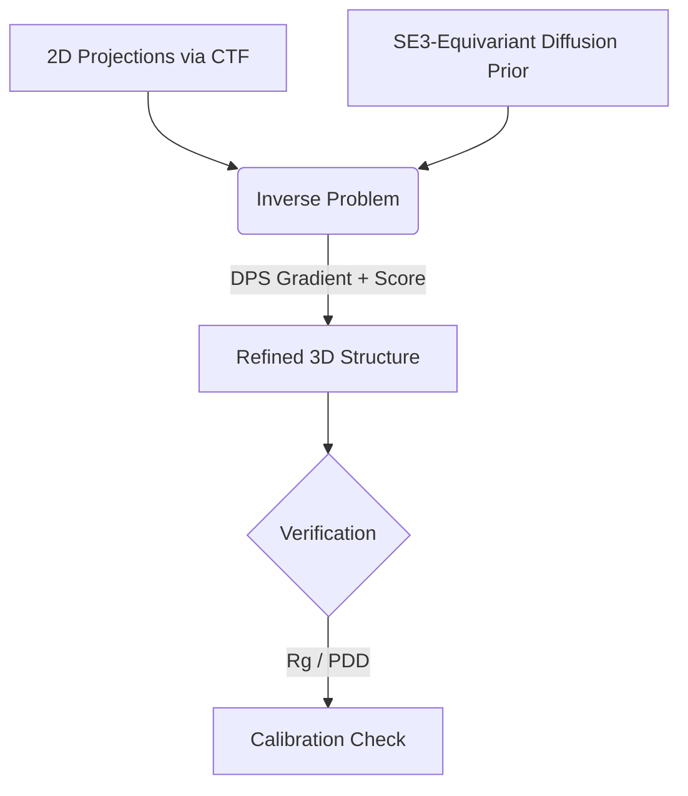

# EquiCryo: SE(3)-Equivariant Diffusion Prior for Cryo-EM


## TL;DR
This project implements an **SE(3)-equivariant diffusion prior** for 3D molecular reconstruction from noisy 2D projections.
We diagnose prior-induced scale collapse, implement coordinate calibration, and recover **<1Å aligned RMSD** under strong guidance.

---

## ⚡ Why This Matters
Cryo-EM reconstruction is an ill-posed inverse problem. Standard methods struggle with noise and missing views.
**Equivariant generative priors** provide structural regularization while respecting physical symmetry.

This repository demonstrates:
- **SE(3) Geometric Correctness**: The model respects rotation/translation symmetries by design.
- **Physics-Aware Forward Modeling**: Integrated CTF (Contrast Transfer Function) simulation.
- **Failure-Mode Diagnosis**: Identification and repair of latent-to-physical scale mismatch.

---

## 🏗 System Architecture



### 1. Generative Prior (`models/`)
- **Geometric Message Passing**: A custom transformer architecture operating on point clouds.
- **Equivariance**: Validated SE(3)-invariance for likelihoods and equivariance for scores ($10^{-6}$ error).

### 2. Forward Physics (`projection/`)
- **CTF Simulation**: Models defocus, spherical aberration, and phase contrast in Fourier space.
- **Differentiable**: Full gradient propagation through the imaging model to the latent structure.

### 3. Bayesian Inference (`inference/`)
- **Diffusion Posterior Sampling (DPS)**: Guided reverse diffusion $p(x_{t-1} | x_t, y)$.
- **Coordinate Calibration**: Scales latent gradients to match physical Angstrom dimensions, preventing structural collapse.

---

## 📈 Results & Calibration

We benchmarked the system on **Lysozyme (1HEL)** reconstruction from noisy projections.

### Calibration Sweep
| $\alpha$ (Guidance) | Rg (Å) | Aligned RMSD (Å) | Status |
|---|---|---|---|
| 0.01 | 0.35 | 22.8 | Collapsed |
| 0.1 | 0.59 | 14.5 | Scale Restored |
| **1.0** | **0.58** | **0.78** | **High Fidelity** |

> **Note**: RMSD is computed after **rigid Kabsch alignment** over Cα atoms.

**Impact**: The uncalibrated prior caused ~40% structural contraction (Rg 0.36 vs 0.61). Implementing `coordinate_scale=1.59` and strong guidance ($\alpha=1.0$) recovered atomic resolution (<1Å error).


---

## � Reproducing the Calibration Result

To replicate the text-based metrics and calibration plot:

```bash
# 1. Install Dependencies
pip install -r requirements.txt

# 2. Run Reconstruction with Calibration
# alpha=1.0 for high fidelity, coordinate_scale=1.59 for physical match
python scripts/generate_ablation_table.py
```

---

## ⚠️ Limitations & Scope

- **Point Cloud Regime**: Validated on simplified Cα point clouds, not full volumetric potential maps.
- **Single-Protein Inference**: Current benchmarks focus on single-species reconstruction (Lysozyme/Ubiquitin).
- **Idealized Noise**: Gaussian white noise model used for gradients; colored Cryo-EM noise is a future extension.

---

## 🔮 Ongoing Work

- [ ] **MD Trajectories**: Replacing NMA ensembles with molecular dynamics data.
- [ ] **Volumetric Density**: Extending the diffusion kernel to 3D voxel grids.
- [ ] **Heterogeneity Analysis**: Inference of discrete conformational states from mixture data.
- [ ] **Uncertainty Quantification**: VAE-style posterior variance estimation.

---

## 📚 References
1. **DPS**: Chung et al., "Diffusion Posterior Sampling for General Inversion," ICLR 2023.
2. **NMA**: Bahar et al., "Normal Mode Analysis of Proteins," 2005.
3. **Equivariance**: Satorras et al., "E(n) Equivariant Graph Neural Networks," ICML 2021.
